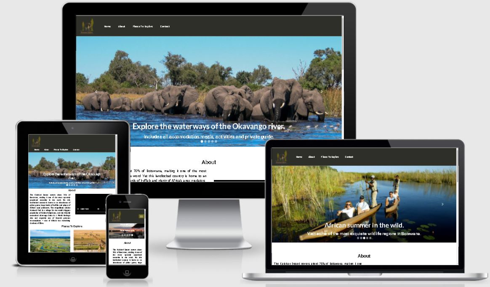

# Explore Botswana Safaris #

## Project Overview
 Safaris in Botswana is a single Web App designed for **tourists or individuals** who want to go on a vacation or visit **safaris in Botswana**.
 
Visiotors to safaris can explore a variety of wildlife in their natural habitat, take part in adventurous outdoor activities and discover the real Africa.

The site can be viewed [here.](https://francisca-heii.github.io/botswana-safaris)

## User Experience 
---

 ### Developer and business Goal :
 * Develop an easy to use interactive site using **HTML, CSS and JavaScript** to the users. In order to choose which places they would like to go for safaries in Botswana.
 * To provide wildlife and activites information to the user.
 * To provide Game reserves, accomodation and resturants information using google maps to the user.
 * To provide information about the current weather using open weather.
 * To provide a very **good User Experience** to keep potential visitors long enough on the site.
 * To present professional and clear branding. 
 * To provide a **look and feel** information about safaries through a short video clip to the user.
 * To show the astoundingly prolific wildlife, varied landscapes, share the Botswana culture and cusine.
 * To offer an amazing array experiences to every visitor.

### Customer's goals :
* To find a destination safari of their choice.
* to find out what type of wildlife, game reserves and activities are available.
* To know what type of accomodation and resturants are available.
* To explore and learn about safaries and culture in Botswana. 
 

 ### The ideal clients to this website is any visitor interested in one of the following :
 * Wildlife and Safari
 * Natural attractions
 * Adventure
 * Culture and History

### Vistors to this website are searching for :
* Places to explore safaris in Botswana.
* Game reserves, Wildlife and activities available.
* Accomodation and resturant to lodge and eat.
* What type of the weather to expect.

### This project is the best way to help them to achieve this because :
* Most of the website have poor User Experience which leads to user leaving the website quickly.
* The website is easy to navigate.
* Provide visitors with the information they need without getting overwhelmed.

## Users stories
* As a user I want to visit a website about safaris in Botswana so that I can explore the site and maybe visit the places.
* As a user I want to see the menu bar so that I can easily navigate the website.
* As a user I want to see animals slider images, with brief information about the Okavango Delta and Chobe National park so that I can have an the idea about the places.
* As a user I want to see an introduction about Botswana safaris and an image so that I can have a better understanding of safaris. 
* As a user I want to see places to explore available in Botswana safaris so that I can have an idea and information when I prepare myself.
* As a user I want to see images and content on each place to explore so that I can have ideas on what to expect.
* As a user I want to see the Botswana map with pinpoints of the Okavango Delta and the Chobe National Park so that I can see where they sit on the map of Botswana.
* As a user I want to be able to click on any of the images/names of places so that I can be taken to one of the places to explore page depending on which image the user clicked on.
* As a user when I click on the image/name of a place to explore, I want to see the animal's image banners so that I can have a feeling about the place and what to expect.
* As a user while I am on the places to explore section, I want to see an introduction about the places for more information.
* As a user I want to see information about the best time to visit, best weather and high season so that I can keep that in mind when planning for my safari trip.
* As a user I want to see images/content about the place, how to get there, lodges and camps so that I can have more information.
* As a user I want to see if a car rental service is available so that I can have access to drive around or go to shops freely.
* As a user I want to see what type of accommodation is available so that I can decide what type of lodgement I would like and if, I need to carry any camping equipment.
* As a user I want to see what wildlife is found in a particular place, so that I can know what wildlife is found in the Okavango Delta and the Chobe National Park.
* As a user I want to find out what type of wildlife is either common, abundant or rare in places to explore so that I can choose which place I want to start or go to.
* As a user I want to compare the Okavango Delta and the Chobe National Park so that I can decide which place I want to explore more.
* As a user I want to see the contact information for the places to explore so that I can send an inquiry if I need more specific information or when I have a question.
* As a user I want to see a map showing restaurants, accommodation and Game reserves found in the Chobe National Park and the Okavango Delta for extra information.
* As a user I want to see the social links of Botswana safaris so that I can follow them.

### Site Scope :

*The following must be incorporated:*
* Easy and intuitive to navigate.
* Carousel image with text sliders for Chobe National Park and the Okavango Delta.
* A responsive design that will present information in a logical format on all devices.
* Apropriate branding and color palette
* A geolocated map on the home screen showing the Okavango Delta and Chobe National park.
* A Video on the home page and wildlife displayed via tooltip on hover or mouse pointer in the Okavango Delta and Chobe National Park pages.
* Banner images on places to explore.

### Structure Plane :
*The site can be used on Mobile, Tablet or desktop, it was designed on mobile first approch.*

Each page has the same structure :
* The logo is on the left and the navigation bar in the center.
* The main body of the page contains the relevant information.
* Footer at the bottom of the page containg social media links and copyright text.

### Skeleton Plane :
I started with a **pen and paper to draw my wireframes,** but ultimately were created using **Figma.** Each page of the application was rendered as a wireframe in **diffrent screen sizes** to show how elements per page would react to different viewport sizes. Each element put down on this stage has made it into the **physical development** of the application with slight changes occuring from the original wireframes.

* [home](wireframe/wireframes1-sketch.jpg)
* [places to explore](wireframe/wireframes2-sketch.jpg)

Mobile:
* [home](wireframe/mobile-home.jpg)
* [places to explore](wireframe/mobile-explore.jpg)

Tablet:
* [home](wireframe/tablet-home.jpg)
* [places to expore](wireframe/tablet-explore.jpg)

### Surface Plane :
---

## Logo ##
To create a logo that scaled well across all devices I create the logo using **Online Logo generator**.

To design this website I first visited the [Chobe National Park](https://chobenationalpark.co.za/)
and the [Botswana Tourism](https://www.botswanatourism.co.bw/explore/chobe-national-park) to take some ideas from the design, customize and flash them out with my personolized ideas.

## Fonts ##
I choose to use **Roboto fonts** through out the  entire website alongside with **Sans Serief** as a fall back. If by any means Roboto fails to load, Sans Serief will load to back up the Roboto font. The font is clear and easy on the eyes.

## Color Scheme ##
Taking into consideration the colors that came with the logo, I decided to use them as the main colors for my website.

The site has plenty of bright, colorful images, video and maps. I wanted to keep it nice and simple. I added a litle bit of color on the navigation bar and the footer. The navigation bar has a **hex color #2f2f29**, favicon and footer **hex #6c631a**. The word **Botswana Safaris**
on the favicon and social links I used a background color of **Orage** and **white** on the navigation links.
 The main color scheme used is the **default white color**

 ## Logo ##
 

 ## Icons ##
 **Icons** used are from [Font Awesome](https://fontawesome.com/), and are **self explanatory**.

 * 
 * 
 * 

## Features

**Responsive on various size devices**

Mobile/small screen size :-

* The site is designed for different screen sizes. The users can view the site on **mobile, tablet or desktop**. Bootsrap grid is used for **structure** of the webpage. I have used a series of containers, rows and columns to **layout and align content.** The bootrap grid system is built with **flexbox** and it is **fully responsive**.
* The menu bar uses the **Boostrap navbar** functionality for **small screen** using the toggle capability for the drop down menu lsit from a **hamburger icon.**
* The navbar will remain **fixed** at the top of the screen at all times when you scroll down the page for easy access.
* The **logo and the hamburger** are suitably aligned on the same line.
* The navbar links has a **black color** to make it standout from the site.
* The **hamburger** has a green and white color to make it distinctive from the site.
* The **logo and the hamburger** are suitably sizead on the same line for small screen.

Desktop/Laptop :-
* The
* The menu bar uses the **Bootstrap navbar** functionality with the navigation links and a log on the left.
* The navbar has a **black color** to make it standout from the site.
* The **menu item** list has a white color and an orange color on hover.

## The interactive elements ##
* The key feature of the site is the interactive visit of places to explore, search for accomodation, game reserve and a place to eat in that particular place. 
* The user can click the **next and previous arrows**  or**BUTTONS** to view the different carousel sliders.
* In the about section, the user can interact with the video.
* A user can click play, volume or pause the video and play the video, or reduce the volune
 

