# Explore Botswana Safaris #

## Project Overview
 Safaris in Botswana is a single Web App designed for **tourists or individuals** who want to go on a vacation or visit **safaris in Botswana**.
 
Visiotors to safaris can explore a variety of wildlife in their natural habitat, take part in adventurous outdoor activities and discover the real Africa.

The site can be viewed [here.](https://francisca-heii.github.io/botswana-safaris)

## User Experience 
---

 ### Developer and business Goal :
 * Develop an easy to use interactive site using **HTML, CSS and JavaScript** to the users. In order to choose which places they would like to go for safaries in Botswana.
 * To provide wildlife and activites information to the user.
 * To provide Game reserves, accomodation and resturants information using google maps to the user.
 * To provide information about the current weather using open weather.
 * To provide a very **good User Experience** to keep potential visitors long enough on the site.
 * To present professional and clear branding. 
 * To provide a **look and feel** information about safaries through a short video clip to the user.
 * To show the astoundingly prolific wildlife, varied landscapes, share the Botswana culture and cusine.
 * To offer an amazing array experiences to every visitor.

### Customer's goals :
* To find a destination safari of their choice.
* to find out what type of wildlife, game reserves and activities are available.
* To know what type of accomodation and resturants are available.
* To explore and learn about safaries and culture in Botswana. 
 

 ### The ideal clients to this website is any visitor interested in one of the following :
 * Wildlife and Safari
 * Natural attractions
 * Adventure
 * Culture and History

### Vistors to this website are searching for :
* Places to explore safaris in Botswana.
* Game reserves, Wildlife and activities available.
* Accomodation and resturant to lodge and eat.
* What type of the weather to expect.

### This project is the best way to help them to achieve this because :
* Most of the website have poor User Experience which leads to user leaving the website quickly.
* The website is easy to navigate.
* Provide visitors with the information they need without getting overwhelmed.

## Users stories
* As a user I want to visit a website about safaris in Botswana so that I can explore the site and maybe visit the places.
* As a user I want to see the menu bar so that I can easily navigate the website.
* As a user I want to see animal slider images, with brief information about the Okavango Delta and Chobe National park so that I can have an the idea about the places.
* As a user I want to see an introduction about Botswana safaris and an image so that I can have a better understanding of safaris. 
* As a user I want to see places to explore available in Botswana safaris so that I can have an idea and information when I prepare myself.
* As a user I want to see images and content on each place to explore so that I can have ideas on what to expect.
* As a user I want to see the Botswana map with pinpoints of the Okavango Delta and the Chobe National Park so that I can see where they sit on the map of Botswana.
* As a user I want to be able to click on any of the images/names of the places so that I can be go to their repective page depending on which image the user clicked on.
* As a user when I click on the image/name of a particluar place to explore, I want to see the animal's image banners so that I can have a feeling about the place and what to expect.
* As a user while I am on the places to explore section, I want to see an introduction about the Okavango Delta and Chobe National Park for more information.
* As a user I want to see information about the best time to visit, best weather and high season so that I can keep that in mind when planning for my safari trip.
* As a user I want to see images/content about the place, lodges and camps so that I can have more information.
* As a user I want to see what type of accommodation is available so that I can decide what type of lodgement I would like and if, I need to carry any camping equipment.
* As a user I want to see what wildlife is found in a particular place, so that I can know what wildlife is found in the Okavango Delta and the Chobe National Park.
* As a user I want to find out what type of wildlife is either common, abundant or rare in places to explore so that I can choose which place I want to start or go to.
* As a user I want to compare the Okavango Delta and the Chobe National Park so that I can decide which place I want to explore more.
* As a user I want to see the contact information on places to explore so that I can send an inquiry if I need more specific information or when I have a question.
* As a user I want to see a map showing restaurants, accommodation and Game reserves found in the Chobe National Park and the Okavango Delta for extra information.
* As a user I want to see the social links of Botswana safaris so that I can follow them.

### User's Journey ###

* As a user I want to visit a website about safaris in Botswana so that I can explore the site and maybe go for a safari tour.
* As a user I want to see the menu bar so that I can easily navigate the website.

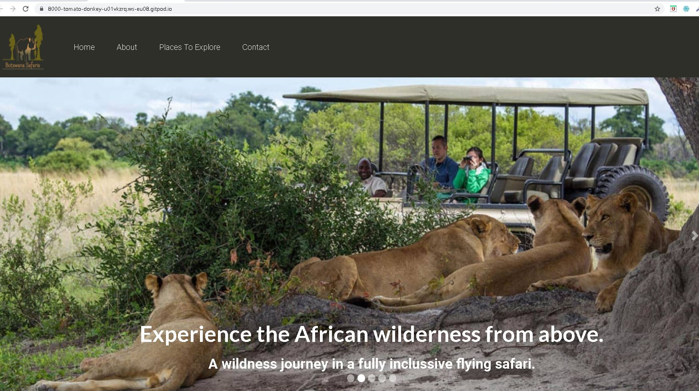

1. The user begins by entering the **url** of Botswana safaries in order to vist the website. When the user land on the webpage they can see the main page with a clear and strong  black navigation bar with white menu items and an elephant logo siting far to the left. The user can now start to navigate the site to explore more.

 * As a user I want to see animal slider images, with brief information about the Okavango Delta and Chobe National park so that I can have an the idea about the places.

 2. While the user is still on the home page, they can see the animal slider images and a brief text giving the information about the site.

 * As a user I want to see an introduction about Botswana safaris and an image so that I can have a better understanding of safaris.

 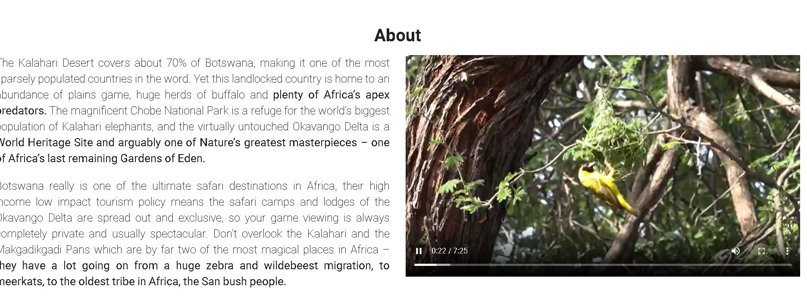

3. When the user click *About* on the navigation bar they straight go to the about section. Here they can find an introduction about Botswana safaris and a video so that they can have a better and a clear understanding about the site.

* As a user I want to see places to explore available in Botswana safaris so that I can have an idea and information when I prepare myself.

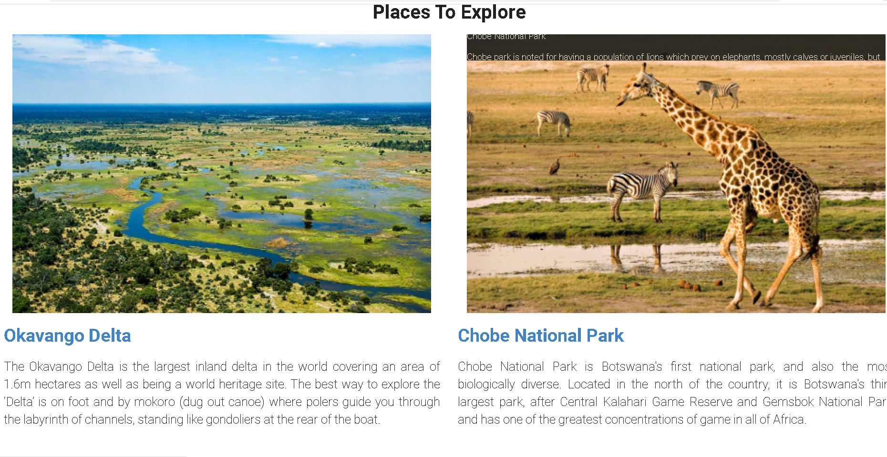

4. When the user scrolls down the page, they will come across the places to explore section. Here they can find images about the Okavango Delta and the Chobe National Park.
By looking at the images the users can have a sence of feeling about the place. They can decide which place they would like to explore and start preparing for their safari travel.

* As a user I want to see images and content about the Okavango Delta and the Chobe National so that I can have ideas about what to expect.

5. The user can find images and content for both the places. when the user mouse hoover on the image they see a nice simple animation whith some text for extra information about that particulat place. Below the text they can see a **link** for both the places to explore and they can easily naviagate to their respective pages.

* As a user I want to see the Botswana map with pinpoints of the Okavango Delta and the Chobe National Park so that I can see where they sit on the map of Botswana.

6. The user can clearly see the pinpoints for the Okavango Delta and the Chone National Park. The user can decide to view via a map or satellite. The user can zoom in and zoom out the map. They can click on the marker to see nore information.

* As a user I want to be able to click on any of the images/names about the places to explore so that I can be taken to  their official page to explore more page depending on which image the user clicked on.

7. 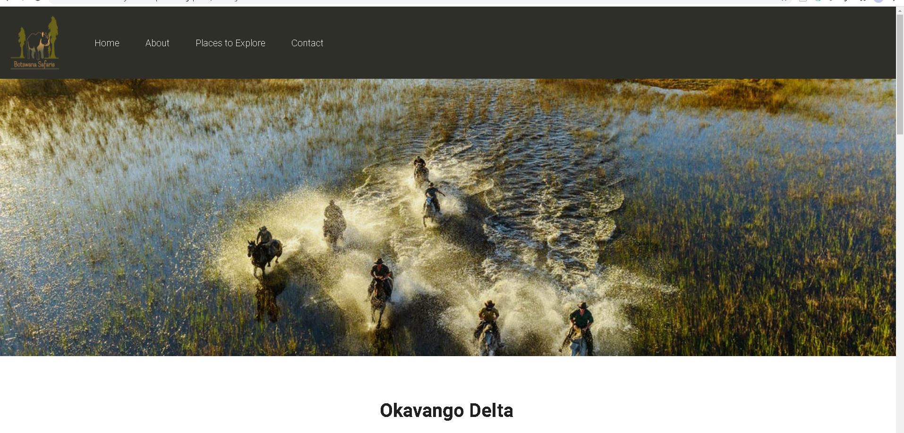

8. While the user is still on the home page, can go to the places to explore section. Here they will find a link which will take them to the next page  *on click of the link.* If the user decide to click on the Okavango delta link, The main page to that place with open in a new page. On landing page is the same navigation bar and logo as the one they saw in the home page.

* As a user when I click on the image/name of a particular place to explore, I want to see the animal image banners so that I can have a feeling about the place and what to expect.

9. Here the user can see the animal banner with people horse riding in the delta. The user can have a sense of feeling about the place.  

* As a user while I remain on the places to explore section, in the Okavango Delta, I want to see an introduction about that particularplace for more information.

 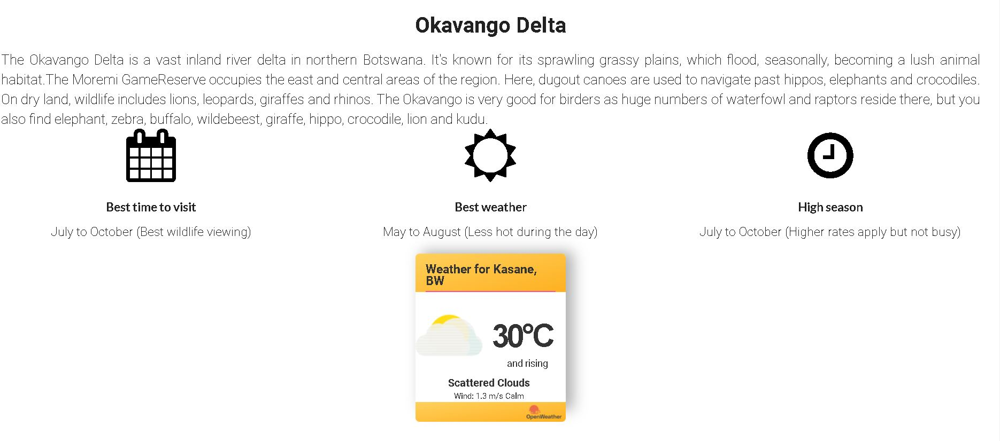

10. The user can find introduction about the Okavango Delta in order to have a clear idea about the place. The introduction is short and on point to keep the user wanting to see.

 As a user I want to see information about the best time to visit, best weather and high season so that I can keep that in mind when planning for my safari trip.

 11. Here the use can easily find the information they are looing for. The can find the best times to visit safaris, the current weather in the Okavango Delta and be informed on the high seasons, so that they can plan for their trip properly.

  * As a user I want to see images/content about the place, how to get there, lodges and camps so that I can have more information.

  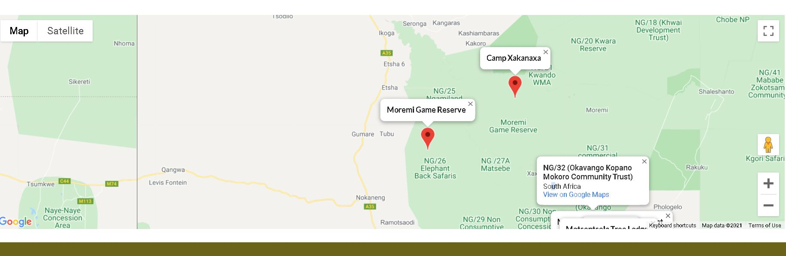

 12.  Here the user, is able to find information about lodges, camps and  game reserves via google maps. They can also view more accomodation and game reserves on goople map satellite. 

 *  As a user I want to see what type of accommodation is available so that I can decide what type of lodgement I would like and if, I need to carry any camping equipment

   

  13.  Here the user can find out again what type of accomodation is available on google maps.

  *  As a user I want to see what wildlife is found in a particular place, so that I can know what wildlife is found in the Okavango Delta and the Chobe National Park.

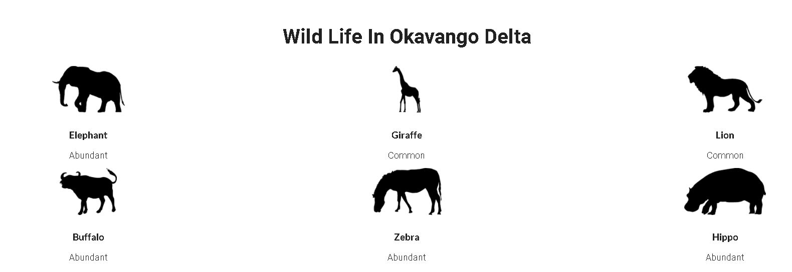

14. Here, the user can easily see what wildlife is avaialble in Okavango Delta and the Chobe National Park. When the user mouse over an elephant image, the actual elephant image is shown in a tooltip. If the user is to view  wildlife in the Okavango Delta on thier mobile devices, they would have to tap on an image instead of mouse hoover.

* As a user I want to find out what type of wildlife is either common, abundant or rare in places to explore so that I can choose which place I want to start or go to.

15. The user is able to tell which wildlife is  either abundant, rare or common in both places. They  can easily find that information below each image.

 * As a user I want to compare the Okavango Delta and the Chobe National Park so that I can decide which place I want to explore more.

15. The user can compare the two places to explore based on  wildlife view, game reserves available, accomodation and actitivies. They can also ask for recommendations by sending the admnistration an email prior to their arial or even while they are there.

* As a user I want to see the contact form so that I can send an inquiry if I need more specific information or when I have a question.

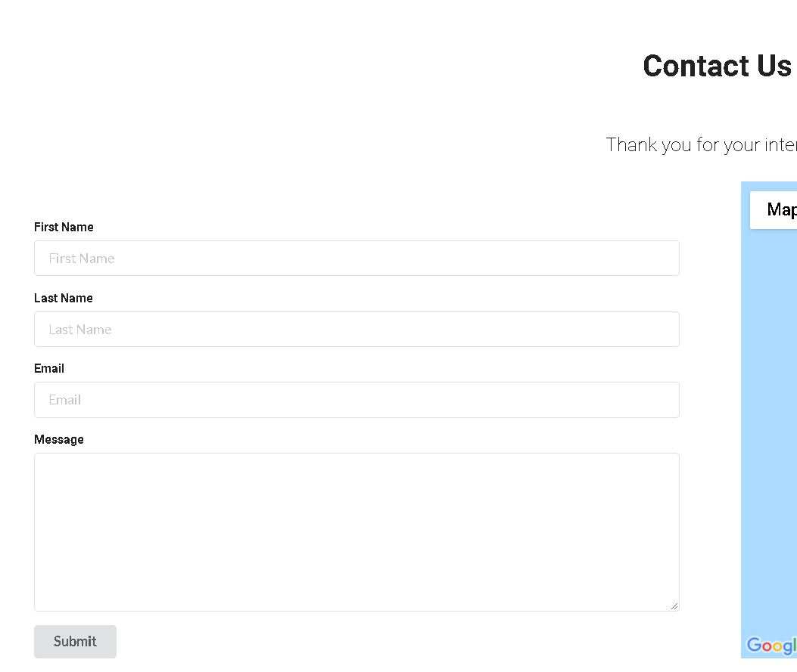

16. The Contact us section has a contact form, which requests client name, last name, email and a box to leave a message.This form plugs into email.js to send an email to the website admin. All input fields are required.

17. When the user has filled in the form with the correct information and click the submit button at the bottom of the page, they will get a green pop up message at the top of the form to say *You have submitted your form succssfully*.

* As a user I want to see the social links of Botswana safaris so that I can follow them.

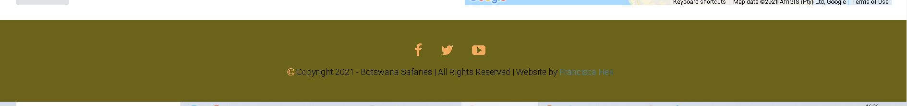

18. The user can follow us on social media for the latest news and updates.

### Site Scope :

*The following must be incorporated:*
* Easy and intuitive to navigate.
* Carousel image with text sliders for Chobe National Park and the Okavango Delta.
* A responsive design that will present information in a logical format on all devices.
* Apropriate branding and color palette
* A geolocated map on the home screen showing the Okavango Delta and Chobe National park.
* A Video on the home page and wildlife displayed via tooltip on hover or mouse pointer in the Okavango Delta and Chobe National Park pages.
* Banner images on places to explore.

### Structure Plane :
*The site can be used on Mobile, Tablet or desktop, it was designed on mobile first approch.*

Each page has the same structure :
* The logo is on the left and the navigation bar in the center.
* The main body of the page contains the relevant information.
* Footer at the bottom of the page containg social media links and copyright text.

### Skeleton Plane :
I started with a **pen and paper to draw my wireframes,** but ultimately were created using **Figma.** Each page of the application was rendered as a wireframe in **diffrent screen sizes** to show how elements per page would react to different viewport sizes. Each element put down on this stage has made it into the **physical development** of the application with slight changes occuring from the original wireframes.

* [home](wireframe/wireframes1-sketch.jpg)
* [places to explore](wireframe/wireframes2-sketch.jpg)

Mobile:
* [home](wireframe/mobile-home.jpg)
* [places to explore](wireframe/mobile-explore.jpg)

Tablet:
* [home](wireframe/tablet-home.jpg)
* [places to expore](wireframe/tablet-explore.jpg)

### Surface Plane :
---

## Logo ##
To create a logo that scaled well across all devices I create the logo using **Online Logo generator**.

To design this website I first visited the [Chobe National Park](https://chobenationalpark.co.za/)
and the [Botswana Tourism](https://www.botswanatourism.co.bw/explore/chobe-national-park) to take some ideas from the design, customize and flash them out with my personolized ideas.

## Fonts ##
I choose to use **Roboto fonts** through out the  entire website alongside with **Sans Serief** as a fall back. If by any means Roboto fails to load, Sans Serief will load to back up the Roboto font. The font is clear and easy on the eyes.

## Color Scheme ##
Taking into consideration the colors that came with the logo, I decided to use them as the main colors for my website.

The site has plenty of bright, colorful images, video and maps. I wanted to keep it nice and simple. I added a litle bit of color on the navigation bar and the footer. The navigation bar has a **hex color #2f2f29**, favicon and footer **hex #6c631a**. The word **Botswana Safaris**
on the favicon and social links I used a background color of **Orage** and **white** on the navigation links.
 The main color scheme used is the **default white color**.

 
 ## Icons ##
 **Icons** used are from [Font Awesome](https://fontawesome.com/), and are **self explanatory**.

  
  
  

 ## Images ##
 * The images used for banners and wildlife images were collected from [pixabaya](https://pixabay.com/).
 * Images for slide shows were collected from [pexels.](https://www.pexels.com/)

## Features
---
The website uses the same basic layout for each page. Each page has a responsive naviagtion bar with a logo placed on the left. Each page has a footer wih a copyright information and social media icons. The site is responsive to all screen sizes, this was achieved using Bootsrap  grid sysytem and css media queries.

Each page has its own image at the top. The home page having slider images about the Okavango Delta and the Chobe National Park. On the other hand, the Okavango Delta and Chobe National Park pages, each features a banner image to grab the user's attention.

#### Home ####
The home page features an **image carousel sliders** showing five different images with text one after another with fade effects. The main purpose of this carousel sliders is to make an impact when the user arrives on the site.

The user can click on the arrows on the side of the image to go to the next slider or to go to the previous slider. The user can also click the **carousel indicators** instead of the arrows.

#### About ####
The about page features two paragraphs and a video. The paragraphs gives the user a brief information about Safaris in Botswana without overwhelning the user.

 The video keep the user engaged and to show the user a litle bit about the Okavango Delta and the chobe National Park in Botswana. The user can choose to fast forward, pause or watch the video in full screen.

#### Places to exlpore ####
The places to explore page has two images. One for **Okavango Delta** and the other one for **Chobe National Park.** This would be the curious section of the site the user cant wait to see. 

When the user mouse over the Okavango Delta it *display animation and text,* on the other hand the *Chobe National Park diplays none.* The text is to give the user a glimpse about the Okavango Delta. When the user mouse out of the image the animation fades away.

Below ecah image is a bold link. Below the Chobe National park image, the user can see a bold link, underneath that, is the introductory text about the Chobe National Park. When the user hit the link *Chobe National Park* it takes the user to the main page of the Chobe National Park.

#### Contact Us ####
This section features a simple form for the user to get in touch with the site administration. The form request for client first name, last name, email addressand benearth that is a box to leave a message.

The form plugs into email.js to send an email to the website admin. All input fields are required. When the form is successfully submitted, a green pop up message is displayed to the user that email sent successfully.

**Map:**
To the right of the form is the map of Botswana showving the two places to explore, that is the Okavango Delta and the Chobe National Park. On mouse click on a marker the a tool tip showing the Okavango Delta is displayed to the user. The user can **x** it out. 

The map has all the controls needed to customise the display to the user's needs and allow the user to focus on a particular area of interest.

To the right-hand side, there are controls to zoom in and out, a pegman and full fullscreen view.

#### Places to Explore ####
*Okavango Delta and the Chobe National Park links:*
In this section when the user click on the link, the official page of the Okavango Delta or Chobe National Park is Displayed. Both pages has a header similar to the *Home page* to keep consistency across all pages.The header contains the navibation bar. On the left hand-side is a logo and a menu items.

Bearth the navigation bar, next the user sees a banner of man riding horses on the Delta if the user has clicked the Okavango link or a banner image showing birds if the user has clicked the Chobe National Park link.. The user can have an idea that they are not only going to view wildlife, they can also find activities to do while visiting the Okavango Delta or Chobe National Park depending on the sesaon.

The next section that follows is a detailed introduction about the places. Information about best time to visit the delta or the Park, best weather and high season. The user can see the current weather in Kasane Town, which is where the Okavango Delta is located. 

**OpenWeather map API key** was used to create the widget and to fetch recent weather data for Kasane(city). The user can see the weather widget displaying information about the current weather in Kasane.

Below that we have a giraffee banner image to keep the unser engaged on the site.

The next section is about the wildlife found in the okavango Delta. In this section the user can see the icons of wildlife, names and a text showing whetehr a ceratin animal is common, abudant or rare.

 When the user mouse over a certain animal, a tool tip with the actual image of that particular animals pops, on mouse leave the tool tip fade away.

When viewed on mobile, the tooltip only display when the user clicks on the animal icon.

The next section is the Okavango map. It contains the controls needed to customize the display to the user's needs and to allow the user to focus on a specific area of interest. On the left-hand side, there are controls to the map to view on full screen,zoom in and out. To the left the user can choose to view either on map or setalite. The user can click on the marker to see places to lodge, eat and game reserves available in the Okavango Delta.

## Technologies used ##
---
### Languages ##
* HTML

* CSS

* JavaScript

## Frameworks, Libraries and Programs ##

* [Figma](https://balsamiq.com/wireframes/)
   
    For creating wireframes.

* [Google Fonts](https://fonts.google.com/)  

    Used for the fonts that appear on the site.

* [Font Awesome](https://fontawesome.com/v5.15/icons?d=gallery&p=2) 

    Used for the icons that were included throughout the project.

* [Favicon.io](https://fonts.google.com/) 

    For generating the favicon. 

* [TinyPNG](https://tinypng.com/)  

    For resizing all the images

* [BeFunky](https://www.befunky.com/create/)

    For resizing all the images.

* [Am I Responsive](http://ami.responsivedesign.is/?url=http://ami.responsivedesign.is/#)

    For providing screenshots of the responsiveness of the website across several devices.

* [emailJS](https://www.emailjs.com/)

    Used to connect the contact form to an email service.

* [Git](https://git-scm.com/)

    For Version control.

* [GitHub](https://github.com/)   

    For storing the repository.

* [GitHub Pages](https://pages.github.com/) 

    For deploying the website live.

* [jQuery](https://jquery.com/)
   
    This framework was used on the index page and places to explore to implement the carousel silder images and  animation.

    [Bootstrap](https://getbootstrap.com/docs/5.0/getting-started/introduction/)

    Used throughout the project to implement the vast majority of the responsiveness in the design.

    ## Application online ##
    ---
*  [Google Chrome Dev Tools](https://developer.chrome.com/docs/devtools/)

    Used extensively to test responsiveness, javascript code etc.

* [W3C CSS Validotor](https://jigsaw.w3.org/css-validator/)

    Used to validate CSS3 code.

* [W3C HTML Validator](https://validator.w3.org/)

    Used to validate HTML5 code.
    

* [jshint](https://jshint.com/)

    Used to check for errors and ommisions in the javascript code. 

*  [Gitpod](https://www.gitpod.io/)  

    For Integrated Development Environment.   

    ### Testing ###
    ---

    ### W3C ###
    W3C Markup Validation Service and W3C CSS Validation Service have been used to check all the pages of the website for semantic and syntax errors.

     * [W3C Markup validation Service](https://jigsaw.w3.org/css-validator/#validate_by_input)
    
     The results are positive and the code is valid.

    **style.css** 

    *  No error detected in the style sheet.
     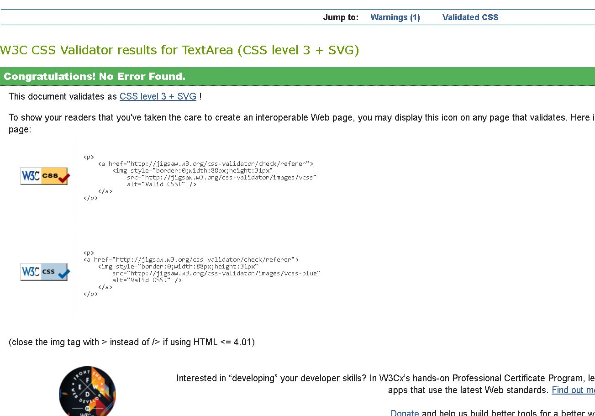

    **index.html**  : Some **alt " "** attributes erros were detected and fixed that by giving a relevant name to the image referenced. Now no erros detected and showing three warnings.

     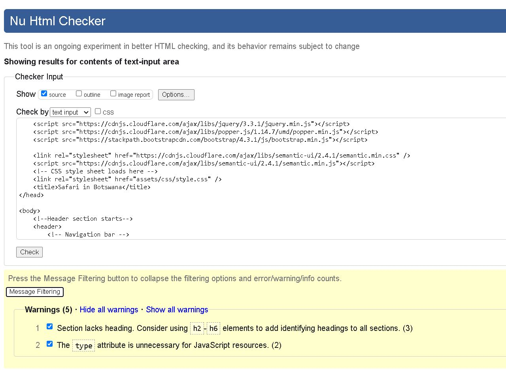
     
     
    **chobe natioanl park page** :
      In the chobe national park page, some **alt " "** attributes erros were detected and fixed that by giving a relevant name to the image referenced. Now no erros detected and showing three warnings.

     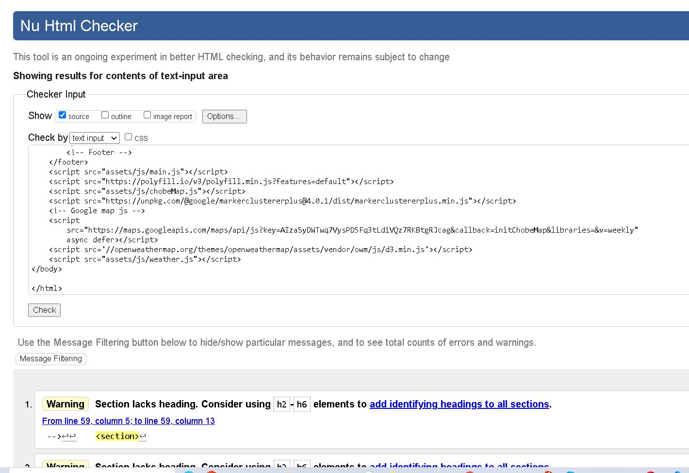

**okavango delta page** :
       some **alt " "** attributes erros were detected and fixed that by giving a relevant name to the image referenced. Now no erros detected and showing two warnings.

## Responsiveness of the website ##
---

* Chrome Developer tools and AM I Reponsive was used to test the responsiveness of the webiste on different device screen sizes.

NOTE:

* I noticed that on Iphone 375 text on the carousel slider image 1 and 2 is being pushed to the top of the naviagtion bar which lead to difficulties in reading.

* The same issue is present agin in Iphone S/5E

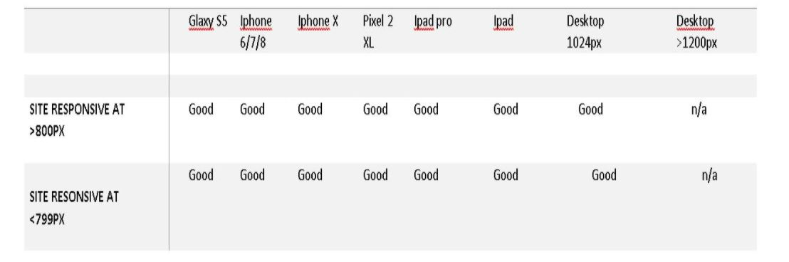

## Browser Compatability ##

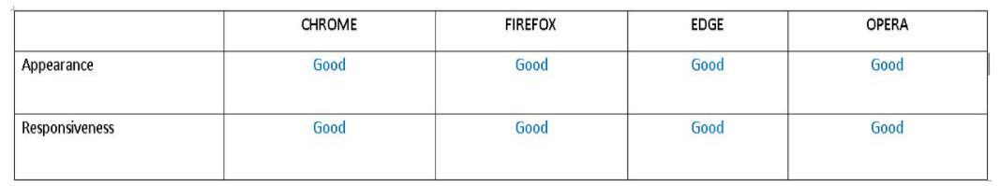

* The website is compatable on most browsers. 

* This was tested on Chrome, Opera, Firefox and Microsoft edge browsers.

*I noticed that on Iphone 375 text on the carousel slider image 1 and 2 is being pushed to the top of the naviagtion bar which lead to difficulties in reading.

## Bugs Discovered: ##
* The main issue I faced was when implementing the maps as I had to show all the coordinates of restaurants, game reserve and accommodation.

* The coordinates found on the web were not exactly available in Google maps. I did multiple rounds of coordinate verification, and adjusted the zoom size of map accordingly for a better view.

* I also faced a challenge to fix some of the bugs in css which were related to responsiveness and carousel slider text. 

* To fix the responsiveness I added some breakpoints on certain parts.

### JSHint ###

[JShint](https://jshint.com/) was used to validate the JavaScript code for semantic and syntax errors. No warnings or error were found.
The results are positive and the code is valid.

* [Openweathermap](https://openweathermap.org/current)

     Free API to get the current weather report. Need account to get API key. Rate Limiting: 60 calls per minute and 1,000,000 calls per month.

     [google maps](https://cloud.google.com/maps-platform)

     Free API to get geolocation of user. Usable without API key. No Rate limiting.

     ### Deployment ###
     ---
     #### How the project was deployed on GitHub Pages: ####
     ---

     The project was coded in Gitpod, committed to Git and pushed to GitHub. The project was deployed from its Github repository using GitHub Pages.

     The steps to deploy the site to GitHub pages are as follows:

* Log into GitHub.
* From the list of repositories on the screen, select Botswana-safaris.
* From the menu items near the top of the page, select Settings.
* Scroll down to the GitHub Pages section.
* Under Source click the drop-down menu labelled None and select Master Branch
* On selecting Master Branch the page is automatically refreshed, the website is now deployed.
* Scroll back down to the GitHub Pages section to retrieve the link to the deployed website.

### How to run this project locally: ###

 *To clone this project from GitHub*

* Created a folder named "mile-stone-pro" on desktop
Go to GitHub
* Under the repository's name, click clone or download
* In the clone with HTTP section copy the url provided
* Open the comand line and type "git bash"
* Then change the current working directory to desktop then folder
* type git "clone" and then paste the URL coppied from github
* Press enter and the local cone is Created in the folder "mile-stone-pro" on you desktop.

### Implementing API ###
---
 [emailJS](https://www.emailjs.com/)  is used in this project in order to manage the contact form of the website.
 
  It is an API (Application Programming Interface), that allows emails management using JavaScript, without needing the server side.

  To implement EmailJS take the following steps :

  * Create an account by [Signing up.](https://dashboard.emailjs.com/sign-up) Free account are avaible and was used in this project limiting the number of email to 200 per month.

  * On the dashboard, click on add new service, then select Gmail.
  * Change the name to WxBrief and the service ID to wxbrief.
 *  Click connect account and connect your desired Gmail account.
* Click create service.
* On the left-hand side of the dashboard, click on email templates.
* Click on Create New Template.
* In the content tab of the template fill out the template like below.
* In the settings tab of the template, change the template ID to "contact-form".
* Click save in the top right of the template.
* On the left-hand side of the dashboard, click on integration.
* Scroll down and copy your Access Token.
* Paste this token into KEY.emailjs in the config.js file.

#### OpenWeatherAPI: ####

[OpenWeatherAPI](https://openweathermap.org/api) Used to generate live weather in places to explore.
* Sign up for a free account for free [here.](https://home.openweathermap.org/users/sign_up)
* Sign inot you account [here.](https://home.openweathermap.org/users/sign_in)
* Copy the API Key.
* Paste this key into weather.js.

## Credits ##
---

Resources used include: 

* [Botswana Toursim](https://www.botswanatourism.co.bw/)

* [Chobe NationalmPark](https://www.chobe.com/) 

* [Guide to visiting Chobe](https://drinkteatravel.com/guide-chobe-national-park-botswana/)

* [Best-Botswana- Safaris](https://www.go2africa.com/destinations/okavango-delta/why-go)

* [Okavango Delta](https://www.okavango.com/)

* Text in the website from [Botswana Safaris](https://www.kuoni.co.uk/botswana/safaris)

* To structure the website I got ideas here [Bootstrap Grid System](https://getbootstrap.com/docs/4.0/getting-started/download/)

* Most references was taken from site for reference [W3Shools](https://www.w3schools.com/) and [satck overflow](https://stackoverflow.com/)

* Code reference [CSS-Tricks](https://css-tricks.com/)

* Code reference [JavaScript](https://developer.mozilla.org/en-US/docs/Web/JavaScript) and [EloquentJavaScript](https://eloquentjavascript.net/)

## Acknowledgments ##
---

I would like to thank my Supervisor Precoius Ijele for his guidance and pointing me out to the right direction. 

Tutor support especially Michael, he  has been very helful and giving me directions oh how to fix some of the bugs.

Code Institiute team who have been a great source of support and my fellow colleagues from slack community.

To conclude I cannot forget to thank my friends for their unconditional support.

    

    

    

 

